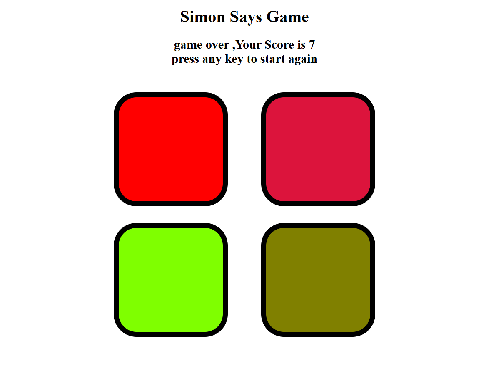

🎮 Simon Says Game

An interactive memory game built using HTML, CSS, and JavaScript.

The game generates a sequence of colors that the player must remember and repeat correctly. With each level, the sequence becomes longer, making the game progressively more challenging.

## 📸 Preview

🚀 Features

✅ Random color sequence generation
✅ Interactive flash animations
✅ Level progression system
✅ User input validation
✅ Game Over detection
✅ Restart functionality

🛠️ Technologies Used

1. HTML5
2. CSS3
3. JavaScript (DOM Manipulation)

🎯 How to Play

1. Start the game.
2. Watch the color that flashes.
3. Click the same color.
4. Each level adds a new color to the sequence.
5. Repeat the complete sequence correctly.
6. The game ends if you click the wrong color.

🧠 Concepts Practiced

1. DOM Manipulation
2. Event Handling
3. Arrays
4. Functions
5. Timers (setTimeout)
6. Game Logic
7. JavaScript Fundamentals

📈 Future Improvements

1. Sound effects
2. High score tracking
3. Mobile responsiveness
4. Difficulty modes
5. Dark theme

👨‍💻 Author

Saif Khan
Built as a JavaScript learning project to practice DOM manipulation and event-driven programming.